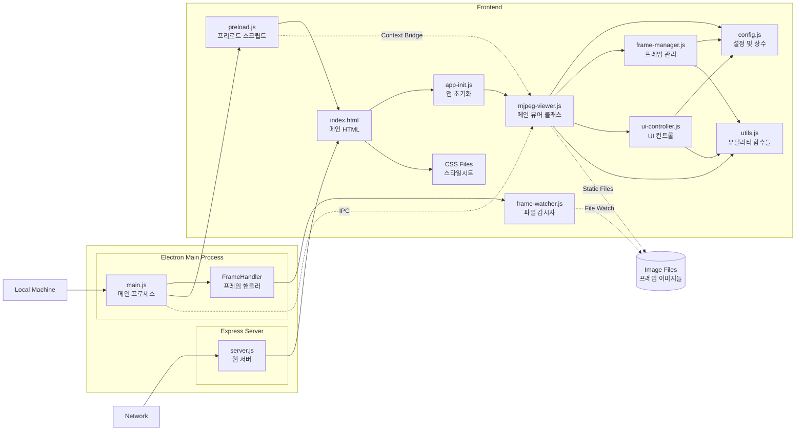
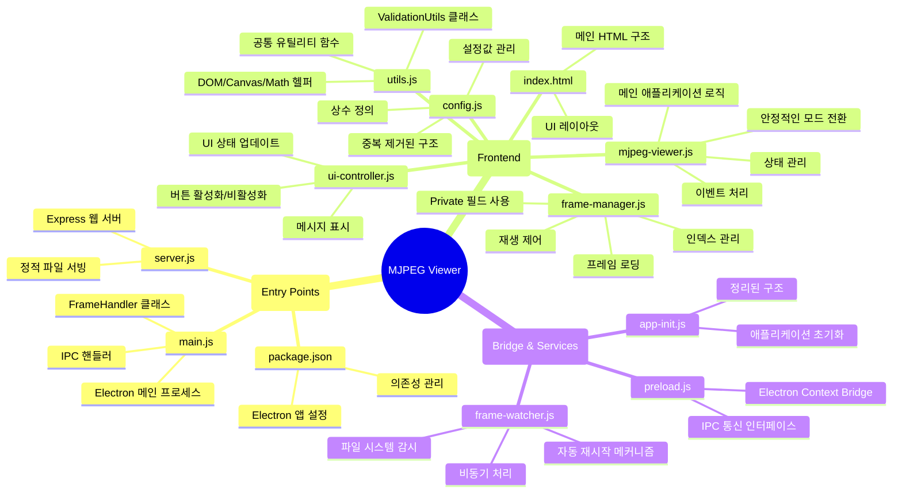
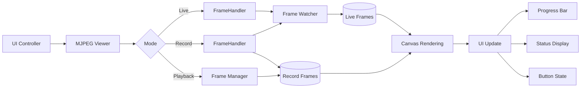

# LG Electronics SoC MJPEG Viewer

## 🌐 **Overview**

이 Application은 연속된 JPEG Stream을 실시간으로 보고, 녹화하며, 녹화된 영상을 다양한 방식으로 재생할 수 있는 기능을 제공합니다.

Electron 기반의 Application으로, 파일 시스템 기반의 MJPEG 스트리밍을 지원합니다.

**Dev. JIRA URL :** http://jira.lge.com/issue/browse/SICDTV-15711

### **Clone Repository**
```bash
git clone ssh://git@source.lge.com:2222/media_bsp/apps/camera.git
```
### **Add your files**
```bash
cd existing_repo
git remote add origin http://source.lge.com/gitlab/media_bsp/apps/camera.git
git branch -M main
git push -uf origin main
```

## 🛠 **Technical Stack**


### **Frontend**
- **HTML5 Canvas**: 비디오 프레임 렌더링
- **Vanilla JavaScript (ES6+)**: 모듈 시스템 사용
- **Tailwind CSS**: User Interface / User Experience 스타일링

### **Backend**
- **Node.js**: v18.0.0 이상
- **Express**: v5.1.0 - 웹 서버 프레임워크
- **Electron**: v36.2.0 - 데스크톱 애플리케이션 프레임워크
- **Chokidar**: v3.6.0 - 파일 시스템 감시

## 💻 **System Requirements**

### **Software**
- Node.js v18.0.0 이상
- npm v8.0.0 이상

## 📦 **Installation Instructions**

### **1. Clone Repository**
```bash
git clone ssh://git@source.lge.com:2222/media_bsp/apps/camera.git
```

### **2. Install Dependencies**

```bash
cd camera
npm install
```

## 🚀 **How to Run**

Electron Application 사용시 Server는 실행시킬 필요 없습니다.

Server는 웹 개발자 도구를 사용한 개발 편의와 외부접속으로 인한 UI/UX Test 및 Feedback을 위함입니다.

### **Electron Application Start (Local Machine)**
```bash
npm start
```

### **Server Start (Web Browser)**
브라우저에서 `http://localhost:3000` 접속

참고로 Live Coding 서버 개발 페이지는 다음과 같습니다. `http://10.178.44.110:3000/`

```bash
npm run dev
# Disable cache
# Detailed logging
# Hot reload support

# or

npm run prod
# Enable cache
# Optimized performance
# Serve compressed static files
```

### **Server Start w/ port change**
```bash
# Windows (CMD)
set PORT=8080 && npm run dev
# or
set PORT=8080 && npm run prod

# Linux
PORT=8080 npm run dev
# or
PORT=8080 npm run prod
```

## ⭐ **Key Features**

### **Live Mode**
- 실시간 MJPEG 스트림 뷰어
- 파일 시스템 기반 프레임 로딩

### **Record Mode**
- 라이브 스트림을 개별 프레임으로 저장
- 녹화 중 실시간 프리뷰
- 녹화 완료 시 자동으로 재생 모드 전환

### **Playback Mode**
- 정방향/역방향 재생
- 프레임 단위 이동 (다음/이전 프레임)
- 빨리감기/되감기
- 반복 재생
- 프로그레스 바를 통한 시크 기능
- 사용자 정의 FPS 설정 (1-60 FPS)

## 🏗️ **System Architecture**



## 🗂️ **Project Structure**

```
    camera/
    ├── main.js                   # Electron 메인 프로세스 (FrameHandler 클래스 포함)
    ├── server.js                 # Express 웹 서버
    ├── package.json              # 프로젝트 설정 및 의존성
    ├── package-lock.json         # 의존성 버전 잠금
    │
    └── public/                   # 웹 애플리케이션 파일
        ├── index.html            # 메인 HTML
        ├── styles/
        │   └── main.css          # 스타일시트
        ├── js/                   # JavaScript 모듈
        │   ├── mjpeg-viewer.js   # 메인 뷰어 클래스
        │   ├── frame-manager.js  # 프레임 관리
        │   ├── ui-controller.js  # UI 제어
        │   ├── config.js         # 설정 및 상수
        │   ├── utils.js          # 유틸리티 함수
        │   ├── frame-watcher.js  # 파일 시스템 감시
        │   ├── preload.js        # Electron 프리로드 스크립트
        │   └── app-init.js       # 애플리케이션 초기화
        ├── live/                 # 라이브 프레임 저장 위치
        └── record/               # 녹화 프레임 저장 위치
```



### **주요 파일 설명**

#### `main.js`
- Electron 메인 프로세스
- **FrameHandler 클래스**: 프레임 관련 로직을 캡슐화
  - 디렉토리 관리
  - 프레임 복사
  - 모드 시작/중지
  - 자동 정리 기능
- IPC 통신 핸들러
- 윈도우 생성 및 관리

#### `server.js`
- Express 웹 서버
- 정적 파일 서빙
- 개발/프로덕션 모드 구분
- 요청 로깅
- 유틸리티 함수들을 객체로 구조화

#### `public/js/mjpeg-viewer.js`
- 메인 애플리케이션 로직
- 상태 관리 및 전환
- 재생 제어
- Private 상수를 통한 설정 관리

#### `public/js/frame-manager.js`
- 프레임 데이터 관리
- 이미지 로딩 및 캐싱
- 프레임 인덱스 제어
- **Private 필드 사용**: `#currentIndex`로 캡슐화
- 통합된 navigate 메서드

#### `public/js/ui-controller.js`
- UI 요소 제어
- 캔버스 렌더링
- 사용자 입력 처리
- 상태 표시

#### `public/js/config.js`
- 애플리케이션 설정값
- 상태 정의
- 에러/정보 메시지
- **중복 제거**: Messages 객체 제거, 직접적인 구조 사용

#### `public/js/utils.js`
- **ValidationUtils 클래스**: 통합된 매개변수 검증
  - validateRequired
  - validateNumber
  - validateString
- 기존 유틸리티 클래스들 (DOMUtils, MathUtils, ImageLoader, TimerUtils, CanvasUtils)
- Private 메서드 사용 (#contextCache, #getContext)

#### `public/js/frame-watcher.js`
- 파일 시스템 감시 (Node.js 환경)
- **자동 재시작 메커니즘**: 에러 발생 시 최대 3회 재시작 시도
- **비동기 함수 사용**: async/await 패턴
- awaitWriteFinish 옵션으로 파일 쓰기 완료 대기

## ➡️ **Data Flow Diagram**



## 🔄 **State Management**

애플리케이션은 4가지 주요 상태를 가집니다:

### **1. IDLE (정지 상태)**
- 초기 상태
- 아무 작업도 수행하지 않음
- 모든 컨트롤 활성화

### **2. LIVE (라이브 모드)**
- 실시간 스트림 표시
- 상세 동작 프로세스:
  1. `FrameHandler.startMode('live')` 호출
  2. `live/` 디렉토리 초기화
  3. `FrameWatcher`가 프레임 파일 감시 시작
  4. IPC를 통해 프레임 경로 전달
  5. Canvas에 실시간 렌더링

### **3. RECORD (녹화 모드)**
- 라이브 스트림을 개별 프레임으로 저장
- 상세 동작 프로세스:
  1. `FrameHandler.startMode('record')` 호출
  2. `record/` 디렉토리 초기화
  3. 프레임 카운터 리셋
  4. `FrameWatcher`가 감지한 프레임을 순차적으로 복사 저장
  5. Canvas에 실시간 렌더링

### **4. PLAYBACK (재생 모드)**
- 녹화된 프레임 시퀀스 재생
- 상세 동작 프로세스:
  1. `FrameManager.loadAllRecordFrames()` 호출
  2. 연속 실패 5회까지 프레임 로딩 시도
  3. Private 필드로 관리되는 currentIndex 사용
  4. navigate 메서드로 프레임 이동
  5. ValidationUtils로 검증된 FPS 값으로 재생

## 🔀 **State Transition Flow**

```mermaid
flowchart LR
    A[IDLE] --> B[LIVE]
    A --> C[RECORD]
    C --> B
    B --> A
    C --> E[PLAYBACK]
    E --> C
    E --> B

    style A fill:#444,stroke:#333,stroke-width:2px,stroke-dasharray: 5 5
```



### **State Transition Trigger**

1. **IDLE → LIVE**
   - Live 버튼 클릭

2. **LIVE → IDLE**
   - Live 버튼 재클릭

3. **IDLE → RECORD**
   - Record 버튼 클릭

4. **LIVE → IDLE → RECORD**
   - Live 모드에서 Record 버튼 클릭
   - 중간에 IDLE 상태를 거쳐 안정적인 전환
   - 200ms 지연으로 프레임 손실 방지

5. **RECORD → PLAYBACK**
   - Record 버튼 재클릭 (수동 중지)
   - 프레임 복사 완료 후 자동 전환

6. **PLAYBACK → RECORD**
   - Record 버튼 클릭
   - 기존 녹화 삭제 후 새로 시작

7. **PLAYBACK → LIVE**
   - Live 버튼 클릭

## 🔑 **Key Components**

### **FrameHandler**
- 프레임 관련 모든 작업 통합 관리
- 디렉토리 관리 및 초기화
- 프레임 복사 및 저장
- Watcher 생명주기 관리
- 에러 처리 및 정리

### **MJPEGViewer**
- Main Controller Class
- State Management and Transition Logic
- Event Handling
- Playback Loop Control

### **FrameManager**
- Frame Data Management
- Image Loading and Caching
- Frame Index Control
- Integrated navigate Method
- Preloading Optimization

### **UIController**
- DOM Element Management
- Canvas Rendering
- Button State Update
- Message Display
- FPS Control

### **ValidationUtils**
- 통합된 매개변수 검증
- 타입 체크 및 범위 검증
- 일관된 에러 메시지
- 코드 중복 제거

### **FrameWatcher**
- 파일 시스템 실시간 감시
- 자동 재시작 메커니즘 (최대 3회)
- 비동기 처리로 안정성 향상
- awaitWriteFinish로 파일 쓰기 완료 대기

### **TimerUtils**
- Accurate Timing Control
- FPS-based Frame Waiting
- ValidationUtils를 활용한 검증

## 🆘 **Trouble-shooting**

### **Frame Loading Fail**
- `public/live` 및 `public/record` 디렉토리 존재 확인
- 디렉토리 쓰기 권한 확인
- 디스크 공간 확인

## 📜 **License**

이 프로젝트는 현재 POC 단계로 배포되지 않습니다.

**jaehong.oh@lge.com**
