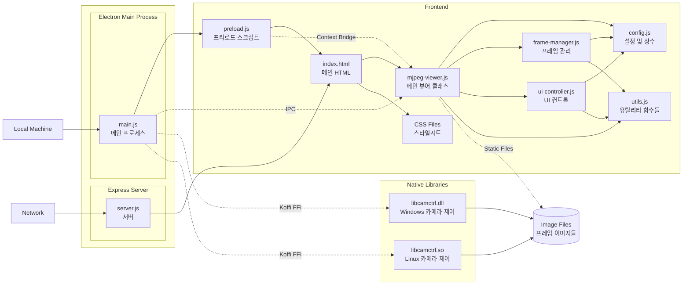
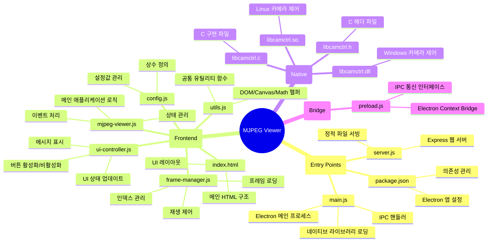
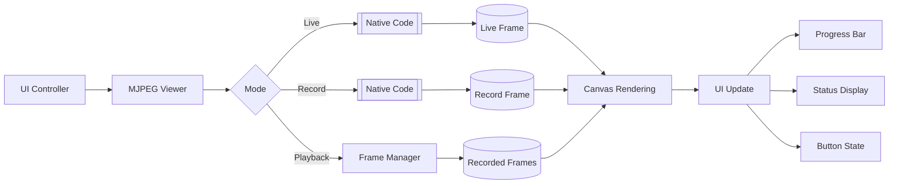
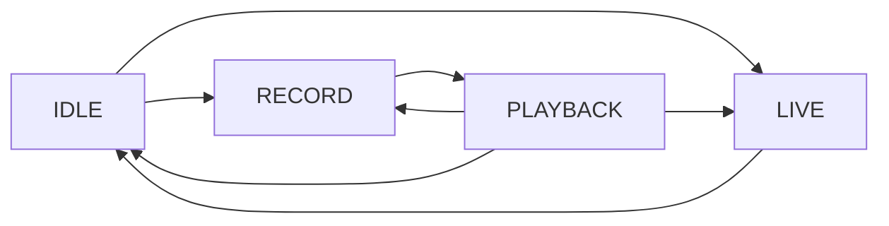

# LG Electronics SoC MJPEG Viewer

## 🌐 **Overview**

이 Application은 연속된 JPEG Stream을 실시간으로 보고, 녹화하며, 녹화된 영상을 다양한 방식으로 재생할 수 있는 기능을 제공합니다.

Electron 기반의 Application으로, Native Camera Control Library를 통해 Streaming을 지원합니다.

**Dev. JIRA URL :** http://jira.lge.com/issue/browse/SICDTV-15711

### **Clone Repository**
```bash
git clone ssh://git@source.lge.com:2222/media_bsp/apps/camera.git
```
### **Add your files**
```bash
cd existing_repo
git remote add origin http://source.lge.com/gitlab/media_bsp/apps/camera.git
git branch -M main
git push -uf origin main
```

## 🛠 **Technical Stack**


### **Frontend**
- **HTML5 Canvas**: 비디오 프레임 렌더링
- **Vanilla JavaScript (ES6+)**: 모듈 시스템 사용
- **Tailwind CSS**: User Interface / User Experience 스타일링

### **Backend**
- **Node.js**: v18.0.0 이상
- **Express**: v5.1.0 - 웹 서버 프레임워크
- **Electron**: v36.2.0 - 데스크톱 애플리케이션 프레임워크

### **Native Code Integration**
- **Koffi**: v2.11.0 - Node.js FFI (Foreign Function Interface)
- **C/C++ DLL**: Windows(.dll)/Linux(.so) 카메라 제어 라이브러리

## 💻 **System Requirements**

### **Software**
- Node.js v18.0.0 이상
- npm v8.0.0 이상

## 📦 **Installation Instructions**

### **1. Clone Repository**
```bash
git clone ssh://git@source.lge.com:2222/media_bsp/apps/camera.git
```

### **2. Install Dependencies**

```bash
cd camera
npm install
```

### **3. Native Code Library Check**
Windows 시스템의 경우 `native/win/libcamctrl.dll` 파일이 존재하는지 확인하세요.
```bash
# Windows DLL build
cl /LD libcamctrl.c /Fe:libcamctrl.dll

### dependency
# Microsoft Visual Studio
# or
# Visual C++ Build Tools + Windows SDK
```

Linux 시스템의 경우 `native/linux/libcamctrl.so` 파일이 존재하는지 확인하세요.
```bash
# Linux so build
gcc -shared -fPIC -o libcamctrl.so libcamctrl.c

### dependency
# GCC (GNU Compiler Collection)
```

## 🚀 **How to Run**

Electron Application 사용시 Server는 실행시킬 필요 없습니다.

Server는 웹 개발자 도구를 사용한 개발 편의와 외부접속으로 인한 UI/UX Test 및 Feedback을 위함이며,

Native Code 동작을 포함한 실제 Device의 동작은 Electron으로만 가능합니다.

### **Electron Application Start (Local Machine)**
```bash
npm start
```

### **Server Start (Web Browser)**
브라우저에서 `http://localhost:3000` 접속

참고로 Live Coding 서버 개발 페이지는 다음과 같습니다. `http://10.178.44.110:3000/`

```bash
npm run dev
# Disable cache
# Detailed logging
# Hot reload support

# or

npm run prod
# Enable cache
# Optimized performance
# Serve compressed static files
```

### **Server Start w/ port change**
```bash
# Windows (CMD)
set PORT=8080 && npm run dev
# or
set PORT=8080 && npm run prod

# Linux
PORT=8080 npm run dev
# or
PORT=8080 npm run prod
```

## ⭐ **Key Features**

### **Live Mode**
- 실시간 MJPEG 스트림 뷰어
- Native Code를 통한 카메라 직접 제어
- Native Code로 부터의 FPS 적용

### **Record Mode**
- 라이브 스트림을 개별 프레임으로 저장
- 녹화 중 실시간 프리뷰
- 녹화 완료 시 자동으로 재생 모드 전환

### **Playback Mode**
- 정방향/역방향 재생
- 프레임 단위 이동 (다음/이전 프레임)
- 빨리감기/되감기
- 반복 재생
- 프로그레스 바를 통한 시크 기능
- 사용자 정의 FPS 설정 (1-60 FPS)

## 🏗️ **System Architecture**



## 🗂️ **Project Structure**

```
    camera/
    ├── main.js                   # Electron 메인 프로세스
    ├── preload.js                # Electron 프리로드 스크립트
    ├── server.js                 # Express 웹 서버
    ├── package.json              # 프로젝트 설정 및 의존성
    ├── package-lock.json         # 의존성 버전 잠금
    │
    ├── native/                   # 네이티브 라이브러리
    │   ├── win/
    │   │   ├── libcamctrl.dll    # Windows용 라이브러리 (.dll)
    │   │   ├── libcamctrl.h      # 헤더 파일
    │   │   ├── libcamctrl.c      # 소스 코드
    │   │   └── dllmain.c         # DLL 진입점
    │   └── linux/
    │       ├── libcamctrl.so     # Linux용 라이브러리 (.so)
    │       ├── libcamctrl.h      # 헤더 파일
    │       └── libcamctrl.c      # 소스 코드
    │
    └── public/                   # 웹 애플리케이션 파일
        ├── index.html            # 메인 HTML
        ├── styles/
        │   └── main.css          # 스타일시트
        ├── js/                   # JavaScript 모듈
        │   ├── mjpeg-viewer.js   # 메인 뷰어 클래스
        │   ├── frame-manager.js  # 프레임 관리
        │   ├── ui-controller.js  # UI 제어
        │   ├── config.js         # 설정 및 상수
        │   └── utils.js          # 유틸리티 함수
        ├── live/                 # 라이브 프레임 저장 위치
        └── record/               # 녹화 프레임 저장 위치
```


### **주요 파일 설명**

#### `main.js`
- Electron 메인 프로세스
- 네이티브 라이브러리 로딩 및 관리
- IPC 통신 핸들러 (`start-live`, `start-record`, `stop-camera`)
- 윈도우 생성 및 관리

#### `server.js`
- Express 웹 서버
- 정적 파일 서빙
- 개발/프로덕션 모드 구분
- 요청 로깅

#### `public/js/mjpeg-viewer.js`
- 메인 애플리케이션 로직
- 상태 관리 및 전환
- 재생 제어
- 네이티브 라이브러리 통신

#### `public/js/frame-manager.js`
- 프레임 데이터 관리
- 이미지 로딩 및 캐싱
- 프레임 인덱스 제어
- 프리로딩 최적화

#### `public/js/ui-controller.js`
- UI 요소 제어
- 캔버스 렌더링
- 사용자 입력 처리
- 상태 표시

#### `public/js/config.js`
- 애플리케이션 설정값
- 상태 정의
- 에러/정보 메시지

## ➡️ **Data Flow Diagram**



## 🔄 **State Management**

애플리케이션은 4가지 주요 상태를 가집니다:

### **1. IDLE (정지 상태)**
- 초기 상태
- 아무 작업도 수행하지 않음
- 모든 컨트롤 활성화

### **2. LIVE (라이브 모드)**
- 실시간 카메라 스트림 표시
- 상세 동작 프로세스:
  1. `startLive()` 호출
  2. Renderer에서 `start-live` 인보크
  3. IPC Handler에서 Native Library의 `run_live()` 호출
  4. Native Library의 `run_live()`에서 반환된 값으로 FPS 값 설정
  5. Canvas에 FPS값에 따라 `live/` 디렉토리에서 `frame.jpg` 이미지를 지속적으로 프레임 렌더링
  6. 모드 전환 시 `stopCamera()` 함수 호출
  7. Renderer에서 `stop-camera` 인보크
  8. IPC Handler에서 Native Library의 `run_stop()` 호출

### **3. RECORD (녹화 모드)**
- 라이브 스트림을 개별 프레임으로 저장
- 상세 동작 프로세스:
  1. `startRecord()` 호출
  2. Renderer에서 `start-record` 인보크
  3. IPC Handler에서 Native Library의 `run_rec()` 호출
  4. Native Library의 `run_rec()`에서 반환된 값으로 FPS 값 설정
  6. 다음 프레임을 확인
  7. Canvas에 FPS값에 따라 `record/` 디렉토리에서 `frame{번호}.jpg` 이미지를 프레임 랜더링
  6. 모드 전환 시 `stopCamera()` 함수 호출
  7. Renderer에서 `stop-camera` 인보크
  8. IPC Handler에서 Native Library의 `run_stop()` 호출

### **4. PLAYBACK (재생 모드)**
- 녹화된 프레임 시퀀스 재생
- 상세 동작 프로세스:
  1. 재생 시작 전 Native Library `run_stop()` 호출로 카메라 정지
  2. `record/` 디렉토리에서 `frame{번호}.jpg` 파일들을 스캔하여 리스팅
  3. 프레임 파일들을 번호순으로 정렬하여 시퀀스 생성
  4. UI의 FPS 입력값에 따라 재생 타이밍 계산 (예: 30 FPS = 33.33ms 간격)
  5. requestAnimationFrame을 사용하여 설정된 FPS로 프레임 순차 재생
  6. 재생 방향(정방향/역방향)에 따라 프레임 인덱스 조정
  7. 프로그레스 바 위치 실시간 업데이트

## 🔀 **State Transition Flow**



### **State Transition Trigger**

1. **IDLE → LIVE**
   - Live 버튼 클릭
   - `run_live()` 호출로 카메라 시작

2. **LIVE → IDLE**
   - Live 버튼 재클릭
   - `run_stop()` 호출로 카메라 중지

3. **IDLE → RECORD**
   - Record 버튼 클릭
   - `run_record()` 호출로 카메라 시작

4. **RECORD → PLAYBACK**
   - Record 버튼 재클릭 (수동 중지)
   - 더 이상 녹화할 프레임이 없을 때 (자동 전환)
   - `run_stop()` 호출로 카메라 중지

5. **PLAYBACK → RECORD**
   - Record 버튼 클릭
   - `run_record()` 호출로 카메라 시작
   - 기존 녹화 삭제 후 새로 시작

6. **PLAYBACK → LIVE**
   - Live 버튼 클릭
   - `run_live()` 호출로 카메라 시작

## 🔑 **Key Components**

### **MJPEGViewer**
- Main Controller Class
- State Management and Transition Logic
- Event Handling
- Playback Loop Control

### **FrameManager**
- Frame Data Management
- Image Loading and Caching
- Frame Index Control
- Preloading Optimization

### **UIController**
- DOM Element Management
- Canvas Rendering
- Button State Update
- Message Display
- FPS Control

### **TimerUtils**
- Accurate Timing Control
- FPS-based Frame Waiting
- Utilizing Performance API

## 🆘 **Trouble-shooting**

### **Native Library Loading Fail**
- Windows Defender 또는 백신 프로그램에서 DLL 차단 확인
- Visual C++ Redistributable 설치 확인
- linux의 경우 permission 확인

### **Frame Loading Fail**
- `public/live` 및 `public/record` 디렉토리 존재 확인
- 디렉토리 쓰기 권한 확인
- 디스크 공간 확인

## 📜 **License**

이 프로젝트는 현재 POC 단계로 배포되지 않습니다.

**jaehong.oh@lge.com**
