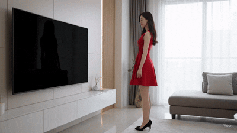
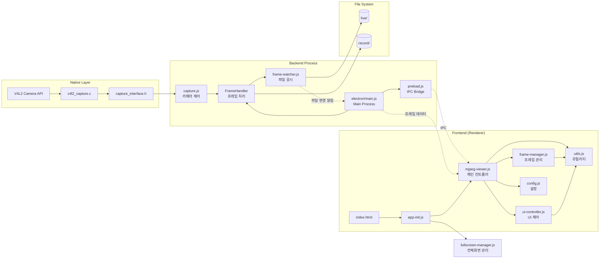
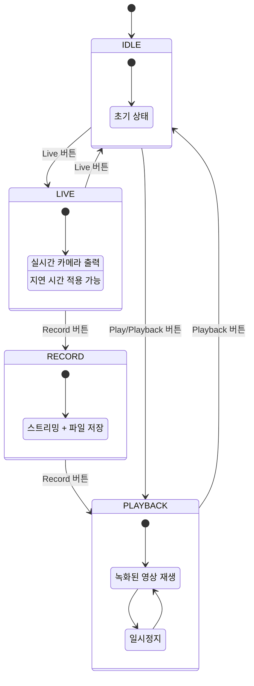

# Delayed Show

## 🌐 **Overview**

이 애플리케이션은 실시간 카메라 스트리밍에 **지연 출력** 기능을 추가한 Electron 기반 데스크톱 애플리케이션입니다.

사용자가 설정한 시간만큼 지연된 영상을 볼 수 있으며, 녹화 및 재생 기능을 제공합니다.



**Dev. JIRA URL :** http://jira.lge.com/issue/browse/SICDTV-15711

### **Clone Repository**
```bash
git clone ssh://git@source.lge.com:2222/media_bsp/apps/camera.git
```
### **Add your files**
```bash
cd existing_repo
git remote add origin http://source.lge.com/gitlab/media_bsp/apps/camera.git
git branch -M main
git push -uf origin main
```

## 🛠 **Technical Stack**


### **Frontend**
- **HTML5 Canvas**: 비디오 프레임 렌더링
- **Vanilla JavaScript (ES6+)**: 모듈 시스템 사용
- **Tailwind CSS**: User Interface / User Experience 스타일링

### **Backend**
- **Node.js**: v18.0.0+
- **Electron**: v36.2.1 - 크로스 플랫폼 데스크톱 앱 프레임워크
- **Chokidar**: v4.0.3 - 파일 시스템 감시

### **Native (Linux)**
- **V4L2 API**: Linux 비디오 캡처
- **C**: 저수준 카메라 제어

## 💻 **System Requirements**

### **Operating System**
- Linux (V4L2 카메라 지원)
- Windows (카메라 캡처 기능 제한)

### **Software**
- Node.js v18.0.0+
- npm v8.0.0+
- Linux: gcc, make (네이티브 모듈 빌드용)

## 📦 **Installation Instructions**

### **1. Clone Repository**
```bash
git clone ssh://git@source.lge.com:2222/media_bsp/apps/camera.git
```

### **2. Install Dependencies**
```bash
cd camera
npm install
```

### **3. Native Code Build (Linux)**
```bash
npm run build
```

## 🚀 **How to Run**

### **Linux**
```bash
npm start
```

### **Windows**
```bash
npm run start:win
```

## 🏗️ **System Architecture**



## 🗂️ **Project Structure**

```
camera/
├── 📁 electron/
│   └── main.js              # Electron 메인 프로세스
├── 📁 frontend/
│   ├── 📁 public/
│   │   ├── index.html       # 메인 UI
│   │   ├── 📁 styles/       # CSS 스타일
│   │   ├── 📁 resources/    # UI 아이콘
│   │   ├── 📁 live/         # 라이브 프레임 임시 저장
│   │   └── 📁 record/       # 녹화 프레임 저장
│   └── 📁 src/
│       ├── app-init.js          # 앱 초기화
│       ├── mjpeg-viewer.js      # 메인 컨트롤러
│       ├── frame-manager.js     # 프레임 관리
│       ├── ui-controller.js     # UI 제어
│       ├── fullscreen-manager.js # 전체화면 모드 관리
│       ├── config.js            # 설정 상수
│       └── utils.js             # 유틸리티
├── 📁 backend/
│   └── 📁 src/
│       ├── capture.js       # 카메라 캡처 제어
│       ├── frame-watcher.js # 파일 시스템 감시
│       ├── preload.js       # Electron IPC
│       └── server.js        # 서버 (확장용)
├── 📁 native/
│   └── 📁 linux/
│       ├── capture_interface.h
│       ├── v4l2_capture.c   # V4L2 카메라 구현
│       └── Makefile
└── package.json
```

## 🔄 **State Management**

애플리케이션은 4가지 주요 상태를 가집니다:



### **State Information**

#### **1. IDLE (대기)**
- 초기 상태
- Live 또는 Playback 모드 진입 가능

#### **2. LIVE (라이브)**
- 실시간 카메라 스트리밍
- **지연 출력**: 0~10초 설정 가능
- **실시간 지연 변경**: 스트리밍 중단 없이 Delay 값 조절 가능
- 프레임은 `frontend/public/live/` 디렉토리에 임시 저장

#### **3. RECORD (녹화)**
- Live 모드에서 무중단 전환
- 스트리밍 계속하면서 프레임을 `frontend/public/record/`에 저장
- 녹화 정보를 `rec_info.json`에 기록

#### **4. PLAYBACK (재생)**
- 녹화된 프레임 시퀀스 재생
- 다양한 재생 제어:
  - 정방향/역방향 재생
  - 속도 조절 (0.2x ~ 4.0x)
  - 프레임 단위 이동
  - 처음/끝으로 이동
  - 반복 재생

## ⭐ **Key Features**

### **📹 Live Mode (라이브 모드)**
- 실시간 카메라 스트리밍
- **지연 출력 기능**: 0~10초 사이 설정
- **실시간 Delay 변경**: 스트리밍 중에도 지연 시간 조절 가능
- Linux에서 V4L2 카메라 자동 감지

### **🔴 Record Mode (녹화 모드)**
- Live 모드에서 즉시 녹화 시작
- 스트리밍 중단 없이 무중단 녹화
- JPEG 시퀀스로 저장
- 녹화 메타데이터 자동 저장

### **▶️ Playback Mode (재생 모드)**
- 녹화된 영상 재생
- **재생 제어**:
  - Play/Pause (재생/일시정지)
  - Reverse (역재생)
  - Next/Previous Frame (프레임 이동)
  - Rewind/Fast Forward (처음/끝)
- **재생 옵션**:
  - Speed: 0.2x ~ 4.0x (0.2 단위)
  - Repeat: 반복 재생
  - Flip: 좌우 반전
- 프로그레스 바로 특정 위치 이동

### **🖥️ Fullscreen Mode (전체화면 모드)**
- **F11 키** 또는 **Full 버튼**으로 전체화면 전환
- 전체화면에서 Escape 키로 종료
- **자동 컨트롤 숨김**: 마우스 정지 시 자동으로 컨트롤 영역 숨김
- **마우스 호버 감지**: 화면 하단 100px 이내로 마우스 이동 시 컨트롤 표시
- 모든 모드(Live, Record, Playback)에서 사용 가능

### **⏱️ Live Delay Control (실시간 지연 제어)**
- **Live 모드 중 지연 시간 변경 가능**
- Delay 값 변경 시 자동으로 스트리밍 재시작
- 0~10초 범위에서 실시간 조절

## 🔑 **Key Components**

### **Backend Components**

#### **FrameHandler** (`electron/main.js`)
- 카메라 캡처 프로세스 관리
- Live/Record 모드 전환 제어
- 프레임 파일 관리 및 정리

#### **Capture Device** (`backend/src/capture.js`)
- V4L2 카메라와 통신
- Unix Socket 기반 IPC
- 카메라 설정 및 제어

#### **FrameWatcher** (`backend/src/frame-watcher.js`)
- Chokidar 기반 파일 감시
- 새 프레임 감지 및 전달
- 자동 재시작 메커니즘 (최대 3회)

### **Frontend Components**

#### **MJPEGViewer** (`frontend/src/mjpeg-viewer.js`)
- 메인 애플리케이션 컨트롤러
- 상태 관리 및 전환 로직
- 사용자 입력 처리

#### **FrameManager** (`frontend/src/frame-manager.js`)
- 프레임 데이터 관리
- 이미지 로딩 및 캐싱
- 프레임 탐색 및 인덱싱

#### **UIController** (`frontend/src/ui-controller.js`)
- DOM 요소 제어
- Canvas 렌더링
- 버튼 상태 업데이트
- 애니메이션 효과

#### **FullscreenManager** (`frontend/src/fullscreen-manager.js`)
- 전체화면 모드 전환 관리
- F11 키 및 버튼 이벤트 처리
- 자동 컨트롤 숨김/표시
- 마우스 움직임 감지

### **Camera Settings**
```javascript
// electron/main.js - FrameHandler.startCapture()
const device = new capture.Device({
    width: 640,      // 해상도 너비
    height: 360,     // 해상도 높이
    fps: 24,         // 초당 프레임
    numFiles: 28     // 버퍼 파일 수 (fps * delay + 4)
});
```

## 📜 **License**

이 프로젝트는 LG Electronics Inc. CTO SoC Center 내부 프로젝트로 아직 배포되지 않습니다.

## 📞 **지원**

**개발팀**: LG Electronics SoC Media BSP Task

**이메일**: mbtask-all@lge.com

**JIRA**: http://jira.lge.com/issue/browse/SICDTV-15711