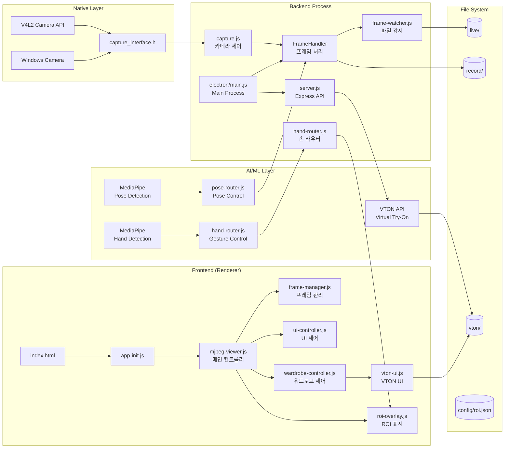
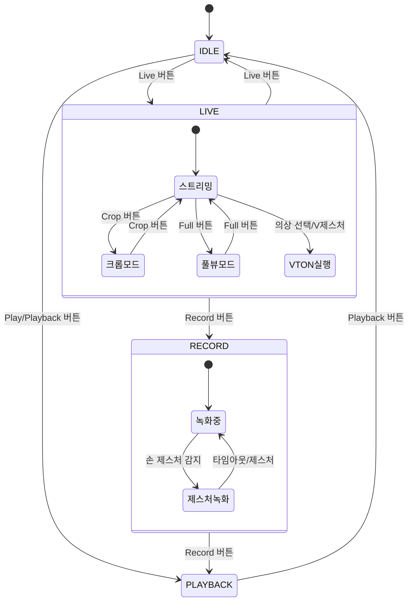

# Delayed Show V2

## 🌐 **Overview**

---

### 👗 v2 : Virtual Try-On + Runway Mode
실시간 카메라 스트리밍에 **VTON(가상 피팅)** 기능을 결합하여, 사용자가 옷장에서 옷을 선택하면 자동으로 가상 착장이 적용됩니다.
착장된 인물은 **런웨이 영상**으로 생성되어, 더욱 몰입감 있는 패션 체험을 제공합니다.


**Collab URL :** http://collab.lge.com/main/pages/viewpage.action?pageId=3252629699

---

### **Clone Repository**
```bash
git clone ssh://git@source.lge.com:2222/media_bsp/apps/camera.git
```

## 🛠 **Technical Stack**


### **Frontend**
- **HTML5 Canvas**: 비디오 프레임 렌더링 및 크롭 모드 지원
- **Vanilla JavaScript (ES6+)**: 모듈 시스템 사용
- **Tailwind CSS**: UI/UX 스타일링
- **MediaPipe**: 손 제스처 인식 (HandLandmarker)

### **Backend**
- **Node.js**: v18.0.0+
- **Electron**: v36.2.1 - 크로스 플랫폼 데스크톱 앱
- **Express**: v4.21.1 - API 서버
- **Python**: MediaPipe 손 감지 및 VTON 처리
- **Sharp**: v0.33.5 - 이미지 처리
- **Socket.io**: v4.8.1 - 실시간 통신

### **Native (Linux/Windows)**
- **V4L2 API**: Linux 비디오 캡처
- **Windows Camera**: Windows 웹캠 지원
- **C**: 저수준 카메라 제어

## 💻 **System Requirements**

### **Operating System**
- Linux (V4L2 카메라 지원)
- Windows 10+ (웹캠 지원)

### **Software**
- Node.js v18.0.0+
- npm v8.0.0+
- Python 3.8+ (MediaPipe용)
- Linux: gcc, make (네이티브 모듈 빌드용)

## 📦 **Installation Instructions**

### **1. Clone Repository**
```bash
git clone ssh://git@source.lge.com:2222/media_bsp/apps/camera.git
cd camera
```

### **2. Install Dependencies**
```bash
npm install
pip install mediapipe opencv-python numpy
```

보드상에서는 bulssi_install.sh 를 수행하여 추가 패키지 자동 설치

### **3. Native Code Build (Linux)**
```bash
npm run build
```

## 🚀 **How to Run**

### **Linux**
보드상에서는 부팅 후 bulssi_init.sh 먼저 수행
```bash
npm start
```

### **Windows**
```bash
npm run start:win
```

## 🏗️ **System Architecture**



## 🗂️ **Project Structure**

```
camera/
├── 📁 electron/
│   └── main.js              # Electron 메인 프로세스 (VTON IPC 추가)
├── 📁 frontend/
│   ├── 📁 public/
│   │   ├── index.html       # 메인 UI (워드로브 섹션 추가)
│   │   ├── 📁 styles/
│   │   │   └── main.css     # 스타일 (크롭/풀 모드 추가)
│   │   ├── 📁 resources/
│   │   │   ├── 📁 wardrobe/ # 의상 이미지들
│   │   │   └── 📁 vton/     # VTON 결과물
│   │   ├── 📁 config/       # ROI 설정
│   │   ├── 📁 live/         # 라이브 프레임
│   │   └── 📁 record/       # 녹화 프레임
│   └── 📁 src/
│       ├── app-init.js             # 앱 초기화
│       ├── mjpeg-viewer.js         # 메인 컨트롤러 (손 제스처 통합)
│       ├── frame-manager.js        # 프레임 관리
│       ├── ui-controller.js        # UI 제어
│       ├── fullscreen-manager.js   # 전체화면 관리
│       ├── capture-helper.js       # 캡처 헬퍼 (크롭 지원)
│       ├── vton-ui.js              # VTON UI 제어
│       ├── vton-service.js         # VTON API 통신
│       ├── wardrobe-controller.js  # 워드로브 컨트롤러
│       ├── wardrobe-data.js        # 의상 데이터
│       ├── roi-overlay.js          # ROI 오버레이
│       └── utils.js                # 유틸리티
├── 📁 backend/
│   └── 📁 src/
│       ├── capture.js              # 카메라 캡처 (녹화 제어)
│       ├── win-capture.js          # Windows 카메라 지원
│       ├── frame-watcher.js        # 파일 감시
│       ├── hand-detection.py       # MediaPipe 손 감지
│       ├── hand-router.js          # 손 제스처 라우터
│       ├── hand-worker.js          # 손 감지 워커
│       ├── pose-detection.py       # MediaPipe 포즈 감지
│       ├── pose-router.js          # 포즈 감지 라우터
│       ├── pose-worker.js          # 포즈 감지 워커
│       ├── roi-config.js           # ROI 설정 관리
│       ├── server.js               # Express 서버
│       └── 📁 routes/
│           ├── vton.js             # VTON API 라우트
│           └── hand-detection.js   # 손 감지 라우트
├── 📁 config/
│   └── roi.json                    # ROI 설정 파일
├── .prettierrc.json                # Prettier 설정
└── package.json
```

## 🔄 **State Management**

V2에서는 기존 4가지 상태에 추가 모드들이 결합됩니다:



### **Additional States**

#### **5. CROP Mode (크롭 모드)**
- 카메라 영상의 중앙 1/3만 표시
- 좌우 블랙 마스킹 처리
- VTON 결과물이 패널에 맞게 확장

#### **6. FULL Mode (풀뷰 모드)**
- 카메라 뷰를 메인 컨테이너 전체로 확장
- VTON 패널, 워드로브, 프로그레스 바 숨김
- 컨트롤 패널은 유지

#### **7. Hand Gesture Mode (손 제스처 모드)**
- MediaPipe를 통한 실시간 손 감지
- V 제스처로 VTON 트리거
- 엄지+검지 제스처로 녹화 제어
- ROI(Region of Interest) 영역 표시

## ⭐ **Key Features (V2 신규)**

### **👗 Virtual Try-On (VTON)**
- **의상 선택**: 워드로브에서 의상 클릭으로 가상 피팅
- **API 연동**: VTON 서버 API 통신 (폴백 목업 지원)
- **성능 모드**: Performance/Balanced/Quality 모드 선택
- **자동 저장**: 결과물 자동 저장 (`frontend/public/vton/`)

### **✋ Hand Gesture Control**
- **MediaPipe 통합**: Python 기반 손 감지 엔진
- **제스처 인식**:
  - V 제스처: VTON 실행
  - 엄지+검지: 녹화 시작/정지
  - 주먹: 모드 초기화
- **ROI 표시**: 손 감지 영역 시각화
- **디버그 모드**: 손 감지 로그 실시간 표시

### **🏃 Pose Detection (Full Body Tracking)**
- **MediaPipe Pose**: 전신 포즈 감지 및 트래킹
- **자동 녹화 트리거**:
  - 전신 감지 시 1초 대기(Dwell) 후 자동 녹화 시작
  - 전신이 사라지면 1초 후 자동 녹화 정지
- **적응형 FPS**: ARM 디바이스에서 자동 FPS 조절 (5fps)
- **모델 복잡도 조절**: 디바이스 성능에 따라 lite/full 모델 선택
- **쿨다운 시스템**: 녹화 간 3초 쿨다운으로 반복 트리거 방지

### **🖼️ Enhanced Camera Modes**
- **Crop Mode**: 중앙 1/3 크롭 with 블랙 마스킹
- **Full View**: 카메라 뷰 최대화
- **Smart Sizing**: 크롭 모드에 따른 VTON 결과 자동 리사이징

### **🎨 UI/UX Improvements**
- **통합 레이아웃**: 단일 행 그리드 시스템
- **워드로브 섹션**: 의상 썸네일 갤러리
- **로딩 인디케이터**: VTON 처리 중 스피너
- **사운드 피드백**: 녹화 시작/정지 사운드
- **반응형 버튼**: 상태에 따른 버튼 활성화/비활성화

### **🔧 Cross-Platform Support**
- **Windows 카메라 지원**: win-capture.js 모듈
- **플랫폼 자동 감지**: OS별 적절한 캡처 모듈 로드
- **통합 프레임 처리**: 플랫폼 독립적 파이프라인

### **📋 Configuration Management**
- **ROI 설정**: config/roi.json으로 손 감지 영역 설정
- **UI 동기화**: Frontend-Backend UI 설정 동기화
- **세션 유지**: 설정 값 세션 간 유지

### **🎯 Recording Enhancements**
- **제스처 녹화**: 손 제스처로 녹화 제어
- **스마트 트리거**: 움직임 감지 기반 자동 녹화
- **향상된 정확도**: 프레임 타이밍 개선
- **썸네일 생성**: 녹화물 썸네일 자동 생성

## 🔑 **Key Components (V2 추가)**

### **Backend Components**

#### **HandRouter** (`backend/src/hand-router.js`)
- MediaPipe 프로세스 관리
- 손 감지 이벤트 라우팅
- ROI 기반 제스처 인식
- 제스처 콜백 처리

#### **HandWorker** (`backend/src/hand-worker.js`)
- Python MediaPipe 래퍼
- 프레임별 손 감지 실행
- 랜드마크 데이터 파싱
- 제스처 분류 로직

#### **PoseRouter** (`backend/src/pose-router.js`)
- MediaPipe Pose 프로세스 관리
- 전신 감지 이벤트 처리
- Dwell 타임 기반 녹화 트리거
- 적응형 FPS 및 쿨다운 관리

#### **PoseWorker** (`backend/src/pose-worker.js`)
- Python MediaPipe Pose 래퍼
- 전신 33개 랜드마크 감지
- ARM 디바이스 최적화
- 모델 복잡도 동적 조절

#### **VTONRoute** (`backend/src/routes/vton.js`)
- VTON API 엔드포인트
- 이미지 업로드 처리
- 작업 큐 관리
- 결과 파일 저장

#### **WinCapture** (`backend/src/win-capture.js`)
- Windows 카메라 인터페이스
- 웹캠 스트림 캡처
- Canvas 기반 프레임 저장
- Linux capture.js와 동일 API

### **Frontend Components**

#### **WardrobeController** (`frontend/src/wardrobe-controller.js`)
- 의상 선택 UI 관리
- VTON 실행 트리거
- 모드 선택 (Performance/Quality)
- 크롭 모드 연동

#### **VTONService** (`frontend/src/vton-service.js`)
- VTON API 클라이언트
- 이미지 업로드 로직
- 폴백 목업 처리
- 작업 상태 폴링

#### **VTONUI** (`frontend/src/vton-ui.js`)
- 로딩 스피너 표시
- 에러 메시지 처리
- 결과 이미지 렌더링
- 크롭 모드별 리사이징

#### **ROIOverlay** (`frontend/src/roi-overlay.js`)
- ROI 영역 시각화
- 손 위치 트래킹
- 제스처 상태 표시
- 디버그 정보 오버레이

### **Configuration**

#### **ROI Configuration** (`config/roi.json`)
```json
{
  "roi": {
    "x": 320,
    "y": 100,
    "width": 200,
    "height": 200,
    "sensitivity": 0.7,
    "gesture_hold_time": 500,
    "cooldown_time": 2000
  },
  "gestures": {
    "thumbs_index": {
      "enabled": true,
      "action": "toggle_recording"
    },
    "v_sign": {
      "enabled": true,
      "action": "trigger_vton"
    },
    "fist": {
      "enabled": true,
      "action": "reset_mode"
    }
  },
  "pose": {
    "enabled": true,
    "dwell_time_ms": 1000,
    "cooldown_ms": 3000,
    "min_detection_confidence": 0.5,
    "min_tracking_confidence": 0.5,
    "model_complexity": 1,
    "fps_limit": 10,
    "arm_optimization": true
  }
```

#### **VTON Modes**
```javascript
// frontend/src/wardrobe-controller.js
const VTON_MODES = {
    performance: { steps: 20, guidance: 2.5 },
    balanced: { steps: 30, guidance: 5 },
    quality: { steps: 50, guidance: 7.5 }
};
```

## 📜 **License**

이 프로젝트는 LG Electronics Inc. CTO SoC Center 내부 프로젝트입니다.

## 📞 **Support**

**개발팀**: LG Electronics SoC Media BSP Task
**이메일**: mbtask-all@lge.com
**Collab**: http://collab.lge.com/main/pages/viewpage.action?pageId=3252629699